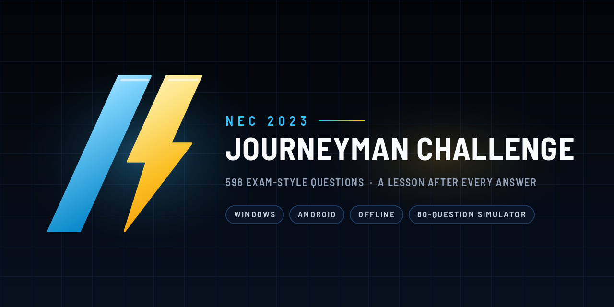
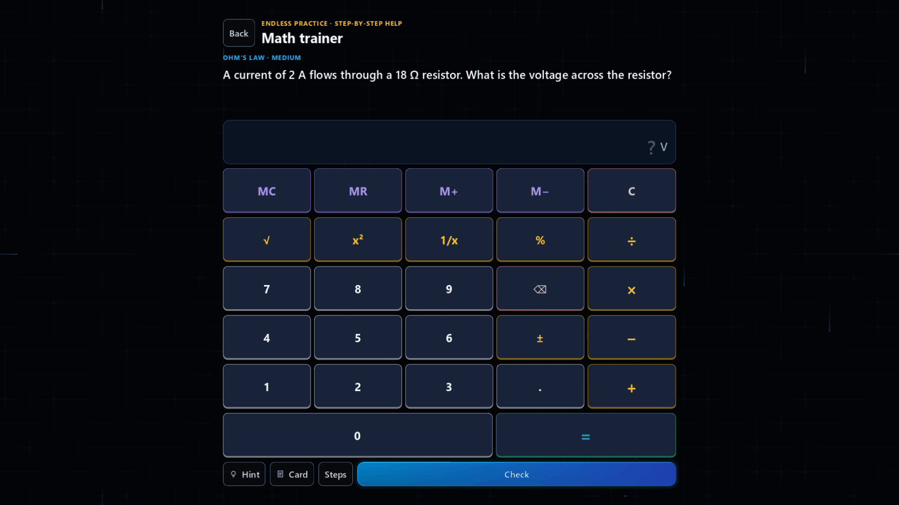
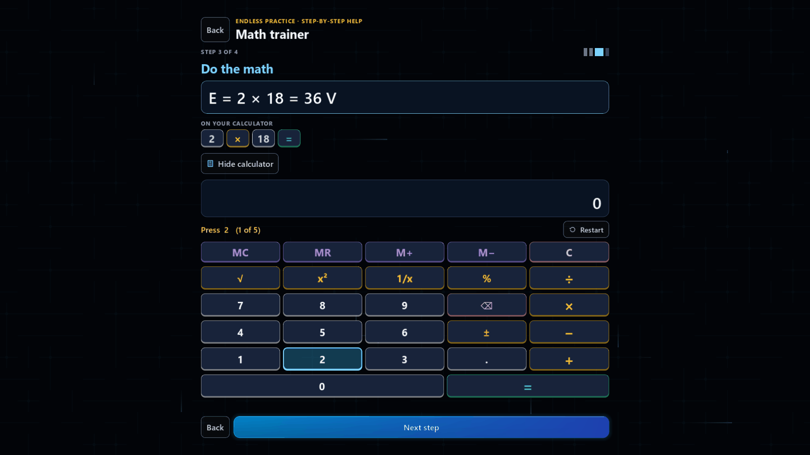
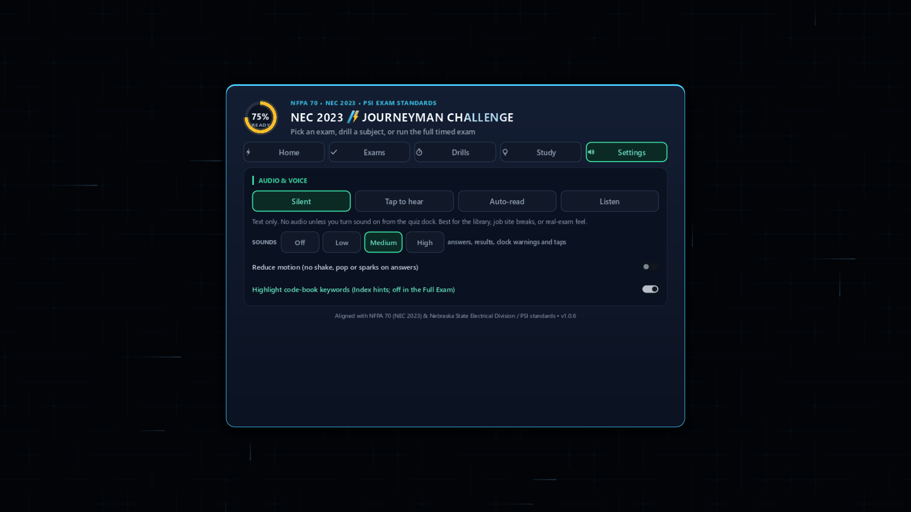
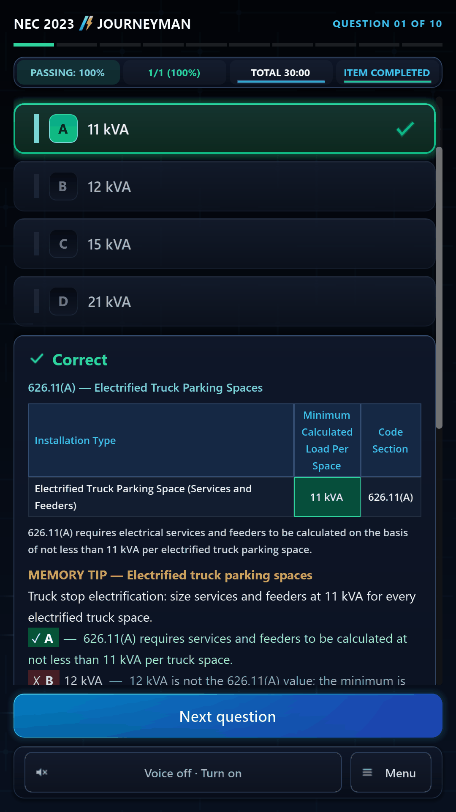
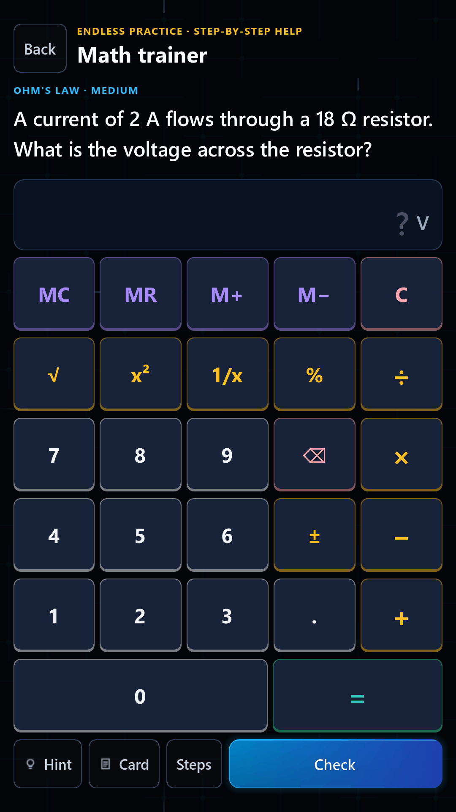

<p align="center">
  
</p>
<h1 align="center"> NEC 2023 Journeyman Challenge</h1>
<p align="center">A study app for the <strong>NEC 2023</strong> <strong>journeyman electrician</strong> exam: timed drills, a full exam simulator built on the <strong>Nebraska</strong> exam blueprint, and a lesson after every answer.</p>
<p align="center">
  
  
  
  
</p>

---

## Download

Get the latest build from the
[Releases page](https://github.com/Gosolceser1/nec-2023-journeyman-challenge/releases/latest).

| File | Best for | Requirement |
|---|---|---|
| [`NEC2023JourneymanChallenge_v1.0.7_Windows.zip`](https://github.com/Gosolceser1/nec-2023-journeyman-challenge/releases/tag/v1.0.7) | Windows PCs | Windows 10/11, 64-bit; no install |
| [`NEC2023JourneymanChallenge_v1.0.7_Android.apk`](https://github.com/Gosolceser1/nec-2023-journeyman-challenge/releases/tag/v1.0.7) | Android phones and tablets | Allow installs from unknown sources |
| [`NEC2023JourneymanChallenge_v1.0.7_macOS.zip`](https://github.com/Gosolceser1/nec-2023-journeyman-challenge/releases/tag/v1.0.7) | Macs, Apple Silicon and Intel | macOS 11+ (Apple Silicon) or 10.13+ (Intel); not notarized, see below |

**Windows:** unzip and run `NEC 2023 Journeyman Challenge.exe`. The app is not
code-signed, so the first time you open it Windows SmartScreen may show
"Windows protected your PC": click **More info**, then **Run anyway**.

**Android:** open the APK on the device and allow installs from unknown sources
if Android asks. A new version installs over the old one and keeps your
progress.

**macOS:** unzip the download (Safari does it for you), drag
`NEC 2023 Journeyman Challenge.app` into **Applications** and open it from
there. The app is not notarized by Apple (that takes a paid developer
account), so macOS stops it the first time:

- **macOS 15 Sequoia and later:** double-click the app and click **Done** when
  macOS says it could not verify it. Then open **System Settings > Privacy &
  Security**, scroll to **Security**, click **Open Anyway** next to the app,
  confirm with **Open Anyway** and your password.
- **macOS 14 Sonoma and earlier:** right-click (or Control-click) the app,
  choose **Open**, then click **Open**.
- **If macOS says the app "is damaged"** or offers no Open Anyway, run this in
  Terminal, then open the app normally:
  `xattr -dr com.apple.quarantine "/Applications/NEC 2023 Journeyman Challenge.app"`

macOS only asks once. Progress is saved in
`~/Library/Application Support/NEC2023JourneymanChallenge`. The zip's
`README.txt` repeats these steps.

`SHA256SUMS.txt` on the release page lets you check the downloads.

---

## Features

- **598 questions:** 594 NEC 2023 questions from 16 practice exams plus 4
  Nebraska State Law questions. Every answer shows the NEC reference, a short
  lesson, a memory tip, why each wrong choice is wrong, and the code provision.
- **You do the looking up:** the exam is open book, so before you answer the
  screen shows only the question, one "where to look" line (NEC 2023 ›
  Chapter › Article), one reference (a table or a figure) and the choices.
  Nothing on it names the exact section or gives the answer away; the
  method, the formula and the table notes wait until you answer. After you
  answer, all four choices stay listed (yours, the right one, the others
  dimmed) and the explanation says each thing once.
- **A menu in five tabs:** Home (continue where you left off, a quick
  drill, your weakest area, review missed questions and the Full Journeyman
  Exam), Exams (every practice exam with the questions you have seen and your
  best score), Drills, Study and Settings.
- **Timed practice drills** of 10, 20, 30, 40 or 50 questions at the exam's
  3 minutes per question, weighted like the exam's content outline, plus a
  10-question drill for each subject area.
- **Full Journeyman Exam:** 80 questions split over the seven subject
  areas like the Nebraska exam blueprint, 240 minutes, 75% to pass. The
  report scores each subject area, charts your pace and estimates your exam
  readiness.
- **Weakest-area drill:** 10 questions from the subject area that needs it
  most, picked from your recent answers.
- **Code-book keywords:** before you answer, the words to look up are
  highlighted in the question. Hover a highlighted word on desktop, or tap it
  on a phone, and the INDEX line shows what to look up the way the printed
  Index lists it ("Disconnecting means › services"), never a section number;
  a click or tap keeps it there. Keywords never contain the answer, and the
  Full Journeyman Exam shows none, like the real test.
- **Step-by-step math:** after you answer an exam calculation question (70 of
  them), "Show steps" walks through it one idea at a time: the formula, the
  numbers, the table row, the math, the exact calculator keys, then the
  answer. "Try it on the calculator" lights up each key in turn on an
  on-screen calculator.
- **Math trainer:** endless practice problems in 58 types over 12 topics
  (Ohm's law to motors and dwelling loads) at three levels, with a hint, the
  steps and a "practice my weak spots" mix. You answer on a basic calculator
  like the one allowed in the exam room (memory, %, x², √, 1/x), and on a PC
  the keyboard works too.
- **Formula cards and table drills:** 17 picture cards (each letter
  explained, units, calculator keys, a worked example) and 17 timed NEC table
  lookup drills with a best run to beat. Math weak spots shows your accuracy
  by topic (see [docs/MATH_TRAINER.md](docs/MATH_TRAINER.md)).
- **Nebraska State Law:** a drill on the State Electrical Act and Board Rules,
  cited to the statute.
- **No repeats, smart reviews:** questions and answer choices are shuffled
  every session, drills draw from no-repeat decks until a subject area is used
  up, and missed questions come back two sessions later.
- **Read-aloud voice:** questions and lessons can be read by a recorded voice
  that ships with the app, including a hands-free Listen mode. With internet,
  Microsoft's natural online voices (Ava, Brian, Emma and more) can read too,
  built in on Windows, macOS and Android with nothing extra to install (the
  desktop builds also offer the British Ryan). Without a connection the recorded voice takes over.
- **Reference tables and diagrams** right next to the question, with tables
  laid out to fit the screen. 346 questions have an original study figure,
  drawn to look like the real equipment in one shared style
  ([docs/DIAGRAM_STYLE.md](docs/DIAGRAM_STYLE.md)). Anything in a figure or
  table that gives away the answer, a choice, or the section, table or Part
  number stays under a "?" until you answer, and a test checks every one.
- **Checked against NEC 2023:** every question's answer, code provision,
  lookup table and calculation was audited against the 2023 code, and all
  598 answers were checked again on 2026-09-30 (see [Accuracy](#accuracy)).
- **Electrical answer animations and sounds**, leveled so they stay pleasant
  for hours, with a Reduce motion option that turns the animations off, and
  keyboard shortcuts on desktop (A-D or 1-4, Enter for next).
- **Works offline:** the questions, the voice and the sounds are all inside
  the app. Progress is saved on your device.

## Screenshots

<p align="center">
  
</p>

<table>
  <tr>
    <td width="50%" align="center">
      <a href="docs/media/desktop-menu.png"></a><br>
      <sub>Home tab: exam readiness ring, continue, a quick drill, your weakest area, missed-question review and the Full Journeyman Exam</sub>
    </td>
    <td width="50%" align="center">
      <a href="docs/media/desktop-table-question.png"></a><br>
      <sub>Before you answer: the article to open, the keyword's Index entry, and the table with the answer and the section left blank</sub>
    </td>
  </tr>
  <tr>
    <td width="50%" align="center">
      <a href="docs/media/desktop-correct.png"></a><br>
      <sub>Correct: the filled-in table, memory tip, every choice explained and the code provision</sub>
    </td>
    <td width="50%" align="center">
      <a href="docs/media/desktop-wrong.png"></a><br>
      <sub>Wrong: your pick in red, the right answer in green, and the figure with its labels revealed</sub>
    </td>
  </tr>
  <tr>
    <td width="50%" align="center">
      <a href="docs/media/desktop-diagram.png"></a><br>
      <sub>A figure question (tap the figure to zoom)</sub>
    </td>
    <td width="50%" align="center">
      <a href="docs/media/desktop-simulator.png"></a><br>
      <sub>The Full Journeyman Exam: 80 questions, 240 minutes; the figure keeps its answer spots under "?"</sub>
    </td>
  </tr>
  <tr>
    <td width="50%" align="center">
      <a href="docs/media/desktop-math-trainer.png"></a><br>
      <sub>Math trainer: work the problem on a basic exam-room calculator, then Check</sub>
    </td>
    <td width="50%" align="center">
      <a href="docs/media/desktop-math-steps.png"></a><br>
      <sub>Show steps: "Try it on the calculator" lights the next key to press</sub>
    </td>
  </tr>
  <tr>
    <td width="50%" align="center">
      <a href="docs/media/desktop-results.png"></a><br>
      <sub>The report: score gauge, subject-area bars against the 75% line, pace per answer and study feedback</sub>
    </td>
    <td width="50%" align="center">
      <a href="docs/media/desktop-settings.png"></a><br>
      <sub>Settings: voice mode, sound level, Reduce motion and the keyword highlights</sub>
    </td>
  </tr>
</table>

<table>
  <tr>
    <td width="20%" align="center">
      <a href="docs/media/mobile-menu.png"></a><br>
      <sub>Android: main menu</sub>
    </td>
    <td width="20%" align="center">
      <a href="docs/media/mobile-question.png"></a><br>
      <sub>Before answering, a keyword tapped</sub>
    </td>
    <td width="20%" align="center">
      <a href="docs/media/mobile-correct.png"></a><br>
      <sub>After answering</sub>
    </td>
    <td width="20%" align="center">
      <a href="docs/media/mobile-math-trainer.png"></a><br>
      <sub>Math trainer</sub>
    </td>
    <td width="20%" align="center">
      <a href="docs/media/mobile-results.png"></a><br>
      <sub>Examination report</sub>
    </td>
  </tr>
</table>

<p align="center">
  <br>
  <sub>A correct answer: the check draws itself as a cyan circuit trace with a spark running down it</sub>
</p>

<p align="center">
  <br>
  <sub>A wrong answer: the X strikes with a short-circuit spark, then the right answer lights up</sub>
</p>

## How studying works

Drills and the simulator follow the Nebraska Journeyman Electrician exam's
content outline (10/20/15/15/10/5/5 items per subject area). Every graded
answer feeds a per-question history, which drives the readiness estimate, the
weakest-area drill and the review queue. The details are in
[docs/STUDY_SYSTEM.md](docs/STUDY_SYSTEM.md).

## Accuracy

The question bank was audited against NFPA 70-2023. Each audit has its own
report, and a guard in `tools/verify.sh` fails the build if an audited item
changes without being re-checked.

| Audit | What was checked | Result |
|---|---|---|
| [Content](docs/CONTENT_AUDIT_2023.md) | All 594 NEC questions: keyed answer, provision wording, choice notes, tips, cited sections | No answer key changed; 60 explanations corrected; 19 questions from the new exams updated to the 2023 wording (key kept); 1 heading to confirm in print |
| [Tables and formulas](docs/TABLES_FORMULAS_AUDIT.md) | Every question that needs a table, calculation or formula | 86 calculations recomputed from NEC 2023 values, 0 mismatches; missing lookup tables and formula hints added |
| [Locations](docs/LOCATION_AUDIT.md) | Chapter, article, section and lookup hint of every question | 0 wrong breadcrumbs; 72 article titles corrected to the 2023 wording |
| [Diagrams](docs/DIAGRAMS_AUDIT.md) | The figures, pixel by pixel, for answer giveaways, and every question a figure would help | 346 questions have an original NEC 2023 figure (119 drawings, including the three the exams require, redrawn), with "?" masks until you answer, each checked against the 2023 text |
| [Answer re-check](docs/audits/UPCODES_ANSWER_CHECK.md) | All 598 questions again: keyed answer, cited section and 2023 wording | No answer key wrong and no citation moved; 9 stems or provisions updated to the 2023 wording (key kept), 3 explanations corrected, 13 pre-answer hints removed |

Open items (such as the 408.5 heading) are in
[docs/KNOWN_ISSUES.md](docs/KNOWN_ISSUES.md). The audits check the questions
against the code; they are not a substitute for your own copy of the NEC.

## Building from source

The app is Godot 4.7.2 and GDScript. The sections below cover running,
verifying and exporting; [docs/RELEASE.md](docs/RELEASE.md) has the full
release steps (branding, Android signing, the shareable zip and checksums).

## Credits

Sound effects are from Pixabay (creators listed in
[assets/sfx/CREDITS.md](assets/sfx/CREDITS.md)); the voice is Microsoft's
"Andrew" neural voice, recorded with edge-tts; the app is made with the
Godot Engine (MIT license). The release zip carries the full `CREDITS.txt`
and `THIRD_PARTY_LICENSES.txt`.

## Disclaimer

An independent study aid, not affiliated with or endorsed by the NFPA, PSI or
the Nebraska State Electrical Division. NFPA 70, National Electrical Code and
NEC are registered trademarks of the National Fire Protection Association.
Always check the current NEC and your local amendments.

---

## Run

Open the folder in Godot 4.7.2, or from a terminal:

```
Godot_v4.7.2-stable_win64_console.exe --path .                 # desktop layout
Godot_v4.7.2-stable_win64_console.exe --path . -- --mobile-ui  # Android layout on desktop
```

The bundled voice clips (`assets/speech/`, about 340 MB: every question plus
every Show steps step of the exam calculations) are generated, not committed.
Without them the app falls back to the system voice. To build them:

```
Godot_v4.7.2-stable_win64_console.exe --headless --path . --script tools/speech/dump_speech.gd
python tools/speech/pregenerate_speech.py --bundle
Godot_v4.7.2-stable_win64_console.exe --headless --path . --import
```

## Verify

```
bash tools/verify.sh                               # import, parse, unit suites, harness x2, bank checks
python tools/pipeline/validate_question_bank.py --no-warn   # bank schema, spoiler gate, NEC 2023 location and content-audit guards
python tools/pipeline/check_requirements.py                 # every table/calc question keeps its table, formula and recomputed result
```

`GODOT` and `PYTHON` override the binaries verify.sh uses. A full run is about
161,000 Godot checks in 43 suites (mostly whole-bank sweeps in both layouts,
including the no-answer-leak guard), the scene harness in both layouts, 165
Python tests and the question-bank validator; with the voice bundle present it
also checks that every question and math step has its clip
([tools/tests/README.md](tools/tests/README.md)).

## Export

Presets live in `export_presets.cfg` (Windows Desktop, Android Debug/Release,
macOS). Their exclude filters keep tests, tools, docs and source PDFs out of the
build. The Windows export is a single exe with the pack embedded; the macOS
export is a universal (Apple Silicon + Intel), ad-hoc signed `.app` in a zip,
built on Windows like the others.

```
mkdir build
Godot_v4.7.2-stable_win64_console.exe --headless --path . --export-release "Windows Desktop" build/NEC2023JourneymanChallenge.exe
python tools/list_pck.py build/NEC2023JourneymanChallenge.exe --desktop   # reads the embedded pack; fails if the voice bundle or a runtime file is missing
```

Godot will not create `build/`, and an export without `assets/speech/`
succeeds silently with no recorded voice, so generate the bundle first.
`docs/RELEASE.md` has the full release steps: icon and branding, Android
signing, the shareable zip and checksums.

## Docs

- `docs/ARCHITECTURE.md`: how the code is organized
- `docs/STUDY_SYSTEM.md`: exam blueprint, question selection, study feedback
- `docs/DATA_PIPELINE.md`: how the question bank is built and validated
- `docs/ADDING_EXAMS.md`: adding a practice exam (PDFs, transcript, curation)
- `docs/EDITION_MIGRATION.md`: switching the NEC edition (2023 to 2026)
- `docs/MATH_TRAINER.md`: step-by-step solutions, math trainer, formula
  cards, table drills and weak spots
- `docs/VOICE_READING_RULES.md`: how questions are spoken
- `docs/ANDROID_VOICES.md`: the Android voice list, names and the Edge voices
- `docs/SFX_PLAN.md`: which moments get a sound, and the motion that goes with it
- [`docs/DIAGRAM_STYLE.md`](docs/DIAGRAM_STYLE.md): how the study figures are drawn
  (equipment, labels, the "?" masks)
- `docs/CONTENT_AUDIT_2023.md`, `docs/TABLES_FORMULAS_AUDIT.md`,
  `docs/LOCATION_AUDIT.md`, `docs/DIAGRAMS_AUDIT.md`: the NEC 2023 audits
- `docs/TYPO_FIXES.md`: every stem and choice correction against the PDFs
- `docs/KNOWN_ISSUES.md`: open items and verification traps
- `docs/audits/`: the working audit reports (answer re-check, diagram gap
  scans, hardcoding audit)
- `docs/RELEASE.md`: building and packaging a release
