<p align="center">
  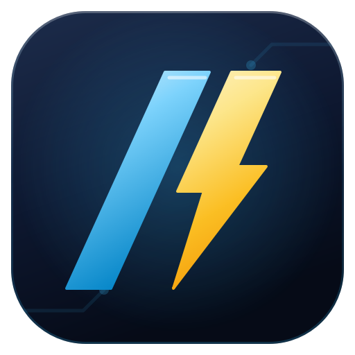
</p>
<h1 align="center">NEC 2023 Journeyman Challenge</h1>
<p align="center">A study app for the <strong>NEC 2023</strong> <strong>journeyman electrician</strong> exam: timed drills, a full exam simulator built on the <strong>Nebraska</strong> exam blueprint, and a lesson after every answer.</p>
<p align="center">
  
  
  
  
</p>

---

## Download

Get the latest build from the
[Releases page](https://github.com/Gosolceser1/nec-2023-journeyman-challenge/releases/latest).

| File | Best for | Requirement |
|---|---|---|
| [`NEC2023JourneymanChallenge_v1.0.4_Windows.zip`](https://github.com/Gosolceser1/nec-2023-journeyman-challenge/releases/tag/v1.0.4) | Windows PCs | Windows 10/11, 64-bit; no install |
| [`NEC2023JourneymanChallenge_v1.0.4_Android.apk`](https://github.com/Gosolceser1/nec-2023-journeyman-challenge/releases/tag/v1.0.4) | Android phones and tablets | Allow installs from unknown sources |

**Windows:** unzip and run `NEC 2023 Journeyman Challenge.exe`. The app is not
code-signed, so the first time you open it Windows SmartScreen may show
"Windows protected your PC": click **More info**, then **Run anyway**.

**Android:** open the APK on the device and allow installs from unknown sources
if Android asks.

`SHA256SUMS.txt` on the release page lets you check the downloads.

---

## Features

- **598 questions:** 594 NEC 2023 questions from 16 practice exams plus 4
  Nebraska State Law questions. Every answer shows the NEC reference, a short
  lesson, a memory tip, why each wrong choice is wrong, and the code provision.
- **Timed practice drills** of 10, 20, 30, 40 or 50 questions at the exam's
  3 minutes per question, weighted like the exam's content outline.
- **Full Journeyman Simulator:** 80 questions split over the seven subject
  areas like the Nebraska exam blueprint, 240 minutes, 75% to pass. The
  report scores each subject area, charts your pace and estimates your exam
  readiness.
- **10 Questions • Weakest Area:** a drill of the subject area that needs it
  most, picked from your recent answers.
- **Step-by-step math:** after you answer an exam calculation question (70 of
  them), "Show steps" walks through it one idea at a time: the formula, the
  numbers, the table row, the math, the exact calculator keys, then the
  answer.
- **Math trainer:** endless practice problems in 58 types over 12 topics
  (Ohm's law to motors and dwelling loads) at three levels, with a hint,
  a keypad, the steps and a "practice my weak spots" mix.
- **Formula cards and table drills:** 17 picture cards (each letter
  explained, units, calculator keys, a worked example) and 17 timed NEC table
  lookup drills with a best run to beat. Math weak spots shows your accuracy
  by topic (see [docs/MATH_TRAINER.md](docs/MATH_TRAINER.md)).
- **Nebraska State Law:** a drill on the State Electrical Act and Board Rules,
  cited to the statute.
- **No repeats, smart reviews:** questions and answer choices are shuffled
  every session, drills draw from no-repeat decks until a subject area is used
  up, and missed questions come back two sessions later.
- **Read-aloud voice:** questions and lessons can be read by a recorded voice
  that ships with the app, including a hands-free Listen mode. With internet,
  Microsoft's natural online voices (Ava, Brian, Emma and more) can read too,
  built in on Windows and Android with nothing extra to install (Windows also
  offers the British Ryan). Without a connection the recorded voice takes over.
- **Reference tables and diagrams** right next to the question, with tables
  laid out to fit the screen. Figures are reviewed for anything that gives the
  answer away, and such a spot stays under a "?" until you answer.
- **Checked against NEC 2023:** every question's answer, code provision,
  lookup table and calculation was audited against the 2023 code (see
  [Accuracy](#accuracy)).
- **Electrical answer animations and sounds** (with a Reduce motion option),
  and keyboard shortcuts on desktop (A-D or 1-4, Enter for next).
- **Works offline:** the questions, the voice and the sounds are all inside
  the app. Progress is saved on your device.

## Screenshots

<p align="center">
  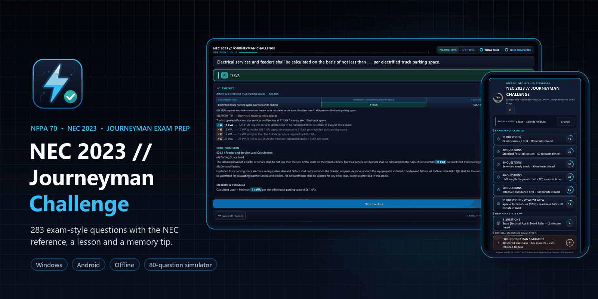
</p>

<table>
  <tr>
    <td width="50%" align="center">
      <a href="docs/media/desktop-menu.png">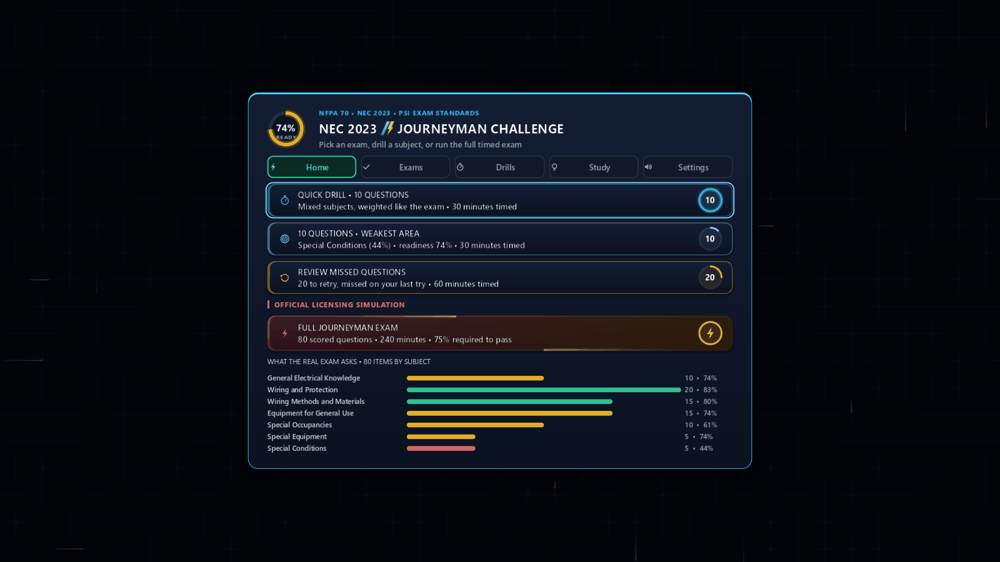</a><br>
      <sub>Main menu: exam readiness ring, timed drills, weakest-area drill, Nebraska State Law and the simulator</sub>
    </td>
    <td width="50%" align="center">
      <a href="docs/media/desktop-table-question.png">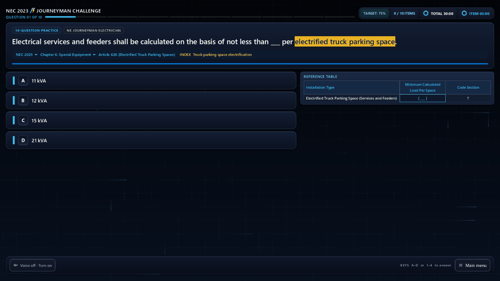</a><br>
      <sub>A question with its lookup table (NEC 626.11, electrified truck parking)</sub>
    </td>
  </tr>
  <tr>
    <td width="50%" align="center">
      <a href="docs/media/desktop-correct.png">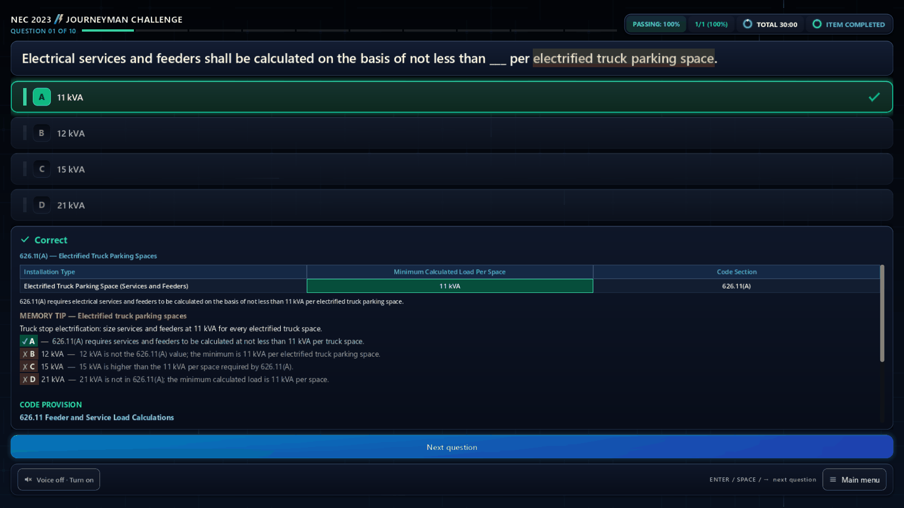</a><br>
      <sub>Correct: the filled-in table, memory tip, every choice explained and the code provision</sub>
    </td>
    <td width="50%" align="center">
      <a href="docs/media/desktop-wrong.png">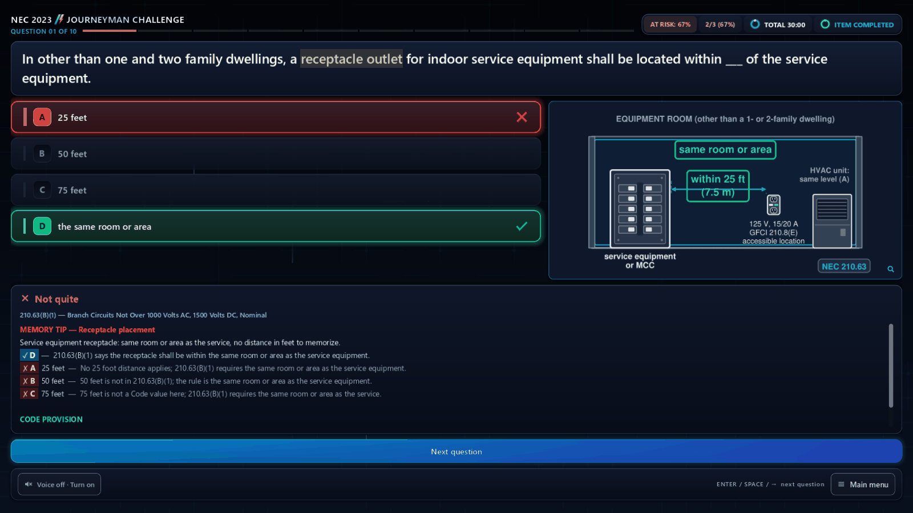</a><br>
      <sub>Wrong: the right answer and the NEC table it comes from</sub>
    </td>
  </tr>
  <tr>
    <td width="50%" align="center">
      <a href="docs/media/desktop-diagram.png">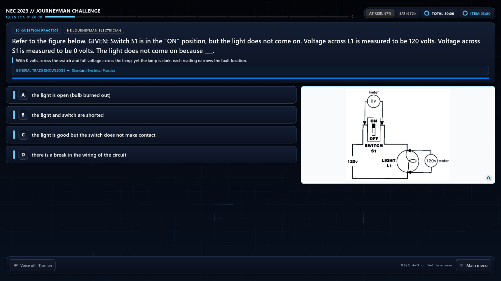</a><br>
      <sub>A diagram question (tap the figure to zoom)</sub>
    </td>
    <td width="50%" align="center">
      <a href="docs/media/desktop-simulator.png">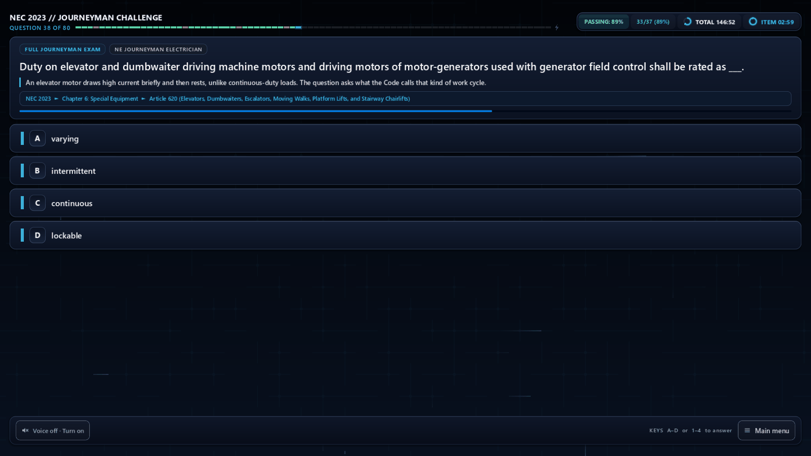</a><br>
      <sub>The Full Journeyman Simulator: 80 questions, 240 minutes</sub>
    </td>
  </tr>
  <tr>
    <td colspan="2" align="center">
      <a href="docs/media/desktop-results.png">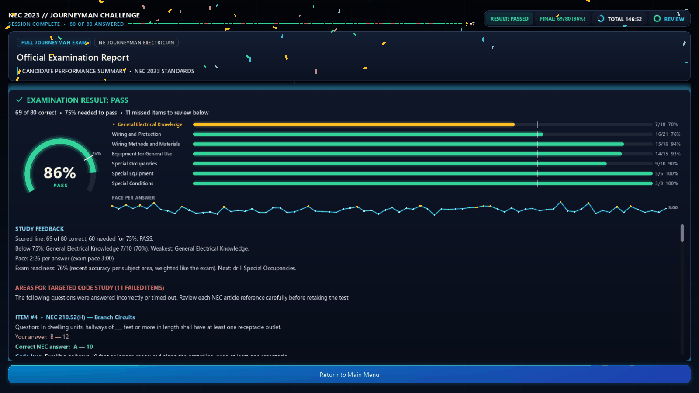</a><br>
      <sub>The report: score gauge, subject-area bars against the 75% line, pace per answer and study feedback</sub>
    </td>
  </tr>
</table>

<table>
  <tr>
    <td width="33%" align="center">
      <a href="docs/media/mobile-menu.png">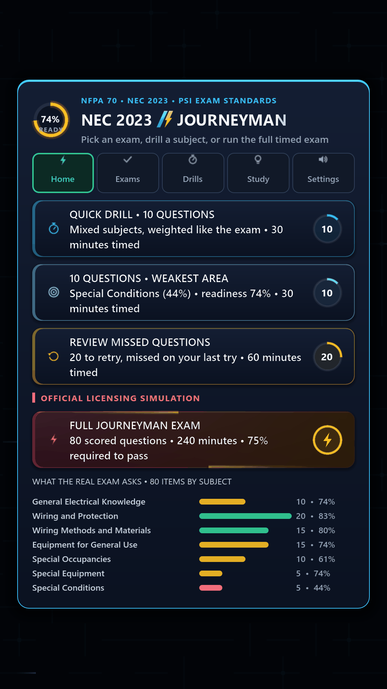</a><br>
      <sub>Android: main menu</sub>
    </td>
    <td width="33%" align="center">
      <a href="docs/media/mobile-question.png">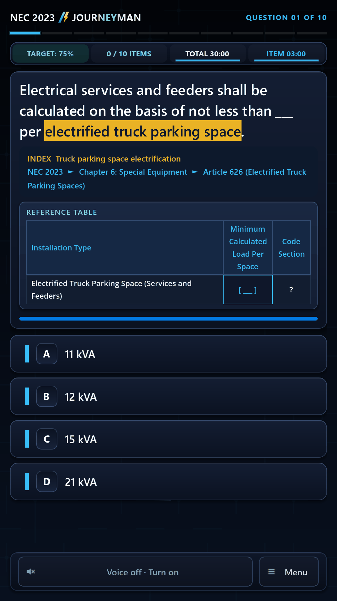</a><br>
      <sub>Android: question with a lookup table</sub>
    </td>
    <td width="33%" align="center">
      <a href="docs/media/mobile-results.png">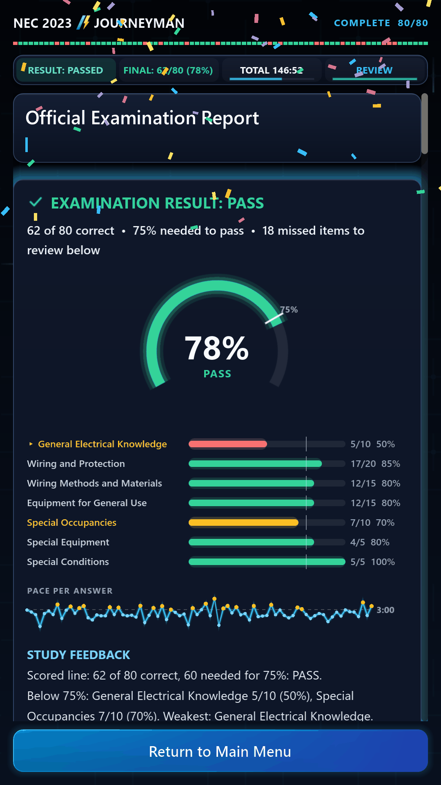</a><br>
      <sub>Android: examination report</sub>
    </td>
  </tr>
</table>

<p align="center">
  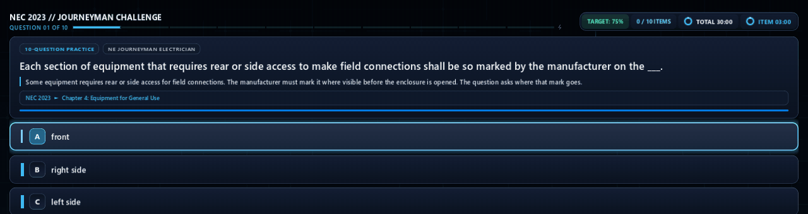<br>
  <sub>A correct answer: the check draws itself as a cyan circuit trace with a spark running down it</sub>
</p>

<p align="center">
  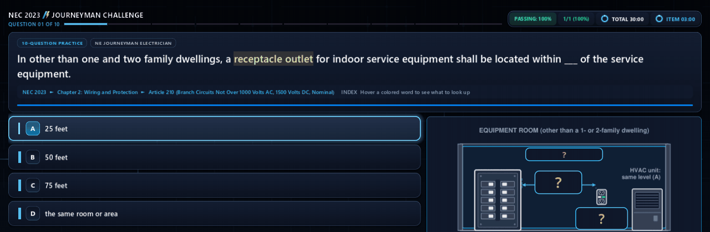<br>
  <sub>A wrong answer: the X strikes with a short-circuit spark, then the right answer lights up</sub>
</p>

## How studying works

Drills and the simulator follow the Nebraska Journeyman Electrician exam's
content outline (10/20/15/15/10/5/5 items per subject area). Every graded
answer feeds a per-question history, which drives the readiness estimate, the
weakest-area drill and the review queue. The details are in
[docs/STUDY_SYSTEM.md](docs/STUDY_SYSTEM.md).

## Accuracy

The question bank was audited against NFPA 70-2023. Each audit has its own
report, and a guard in `tools/verify.sh` fails the build if an audited item
changes without being re-checked.

| Audit | What was checked | Result |
|---|---|---|
| [Content](docs/CONTENT_AUDIT_2023.md) | All 594 NEC questions: keyed answer, provision wording, choice notes, tips, cited sections | No answer key changed; 60 explanations corrected; 19 questions from the new exams updated to the 2023 wording (key kept); 1 heading to confirm in print |
| [Tables and formulas](docs/TABLES_FORMULAS_AUDIT.md) | Every question that needs a table, calculation or formula | 86 calculations recomputed from NEC 2023 values, 0 mismatches; missing lookup tables and formula hints added |
| [Locations](docs/LOCATION_AUDIT.md) | Chapter, article, section and lookup hint of every question | 0 wrong breadcrumbs; 72 article titles corrected to the 2023 wording |
| [Diagrams](docs/DIAGRAMS_AUDIT.md) | The shipped figures, pixel by pixel, for answer giveaways, and every question a figure would help | The three PDF figures need no mask; 88 questions got original NEC 2023 figures (48 drawings) with "?" masks until you answer, each checked against the 2023 text |

Open items (such as the 408.5 heading) are in
[docs/KNOWN_ISSUES.md](docs/KNOWN_ISSUES.md). The audits check the questions
against the code; they are not a substitute for your own copy of the NEC.

## Building from source

The app is Godot 4.7.2 and GDScript. The sections below cover running,
verifying and exporting; [docs/RELEASE.md](docs/RELEASE.md) has the full
release steps (branding, Android signing, the shareable zip and checksums).

## Credits

Sound effects are from Pixabay (creators listed in
[assets/sfx/CREDITS.md](assets/sfx/CREDITS.md)); the voice is Microsoft's
"Andrew" neural voice, recorded with edge-tts; the app is made with the
Godot Engine (MIT license). The release zip carries the full `CREDITS.txt`
and `THIRD_PARTY_LICENSES.txt`.

## Disclaimer

An independent study aid, not affiliated with or endorsed by the NFPA, PSI or
the Nebraska State Electrical Division. NFPA 70, National Electrical Code and
NEC are registered trademarks of the National Fire Protection Association.
Always check the current NEC and your local amendments.

---

## Run

Open the folder in Godot 4.7.2, or from a terminal:

```
Godot_v4.7.2-stable_win64_console.exe --path .                 # desktop layout
Godot_v4.7.2-stable_win64_console.exe --path . -- --mobile-ui  # Android layout on desktop
```

The bundled voice clips (`assets/speech/`, ~138 MB) are generated, not committed.
Without them the app falls back to the system voice. To build them:

```
Godot_v4.7.2-stable_win64_console.exe --headless --path . --script tools/speech/dump_speech.gd
python tools/speech/pregenerate_speech.py --bundle
Godot_v4.7.2-stable_win64_console.exe --headless --path . --import
```

## Verify

```
bash tools/verify.sh                               # import, parse, unit suites, harness x2, bank checks
python tools/pipeline/validate_question_bank.py --no-warn   # bank schema, spoiler gate, NEC 2023 location and content-audit guards
python tools/pipeline/check_requirements.py                 # every table/calc question keeps its table, formula and recomputed result
```

`GODOT` and `PYTHON` override the binaries verify.sh uses.

## Export

Presets live in `export_presets.cfg` (Windows Desktop, Android Debug/Release).
Their exclude filters keep tests, tools, docs and source PDFs out of the build.
The Windows export is a single exe with the pack embedded.

```
mkdir build
Godot_v4.7.2-stable_win64_console.exe --headless --path . --export-release "Windows Desktop" build/NEC2023JourneymanChallenge.exe
python tools/list_pck.py build/NEC2023JourneymanChallenge.exe --desktop   # reads the embedded pack; fails if the voice bundle or a runtime file is missing
```

Godot will not create `build/`, and an export without `assets/speech/`
succeeds silently with no recorded voice, so generate the bundle first.
`docs/RELEASE.md` has the full release steps: icon and branding, Android
signing, the shareable zip and checksums.

## Docs

- `docs/ARCHITECTURE.md`: how the code is organized
- `docs/STUDY_SYSTEM.md`: exam blueprint, question selection, study feedback
- `docs/DATA_PIPELINE.md`: how the question bank is built and validated
- `docs/MATH_TRAINER.md`: step-by-step solutions, math trainer, formula
  cards, table drills and weak spots
- `docs/VOICE_READING_RULES.md`: how questions are spoken
- `docs/ANDROID_VOICES.md`: the Android voice list, names and the Edge voices
- `docs/SFX_PLAN.md`: which moments get a sound
- `docs/CONTENT_AUDIT_2023.md`, `docs/TABLES_FORMULAS_AUDIT.md`,
  `docs/LOCATION_AUDIT.md`, `docs/DIAGRAMS_AUDIT.md`: the NEC 2023 audits
- `docs/TYPO_FIXES.md`: every stem and choice correction against the PDFs
- `docs/KNOWN_ISSUES.md`: open items and verification traps
- `docs/RELEASE.md`: building and packaging a release
